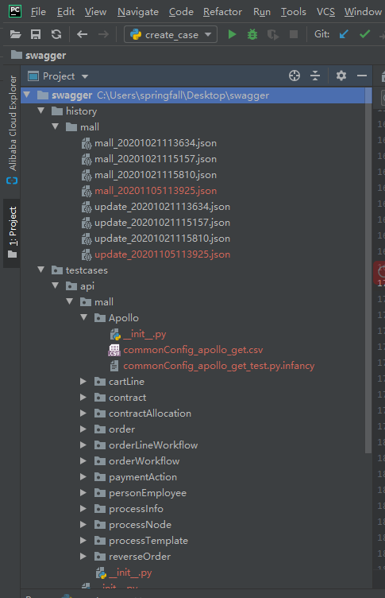

#脚本功能介绍
>本脚本意在公共过访问swagger接口直接获取接口信息生成半成品的httprunner用例脚本。  
#脚本结构
>config.json(配置文件),create_case.py,createCaseFromSwagger.py,util.py为工具的脚本函数,debugtalk.py是根目录定位文件，可以为空。
#脚本使用
>在config.json中配置swagger的相关信息以及生成用例的时候需要添加的相关信息  
>1，mall 项目名称，在这个json中可以配置多个项目。  
>2，url 为swagger docs地址，用户获取swagger信息  
>3，prefix，在从swagger中获取的路径非全路径，有时候需要在 base_url + prefix + path(swagger接口中的接口路径)   
>4，parameter_key 这个是生成接口脚本的时候公共的参数的key  
>5，parameter_value 是生成接口脚本的时候公共参数的参数文件路径  
>6，only 脚本的扩展，在only中有值的时候，仅仅生成only中列的这些接口的接口信息，如果only中为空，则生成全部的swagger中的接口脚本  
#生成用例的情况
>脚本生成过程中产生在testcase/api/model下产生用例文件"contractAllocation_changeBalance_post_test.py.infancy", 文件名对应的接口路径是contractAllocation/changeBalance",接口方法为"post",同文件夹下还会生成对应该接口的参数文件"contractAllocation_changeBalance_post.csv"。  
#生成脚本结构  
>1, 生成用例结构testcases/api/module/(接口文件)，testcases/api为固定文件夹结构，module为配置文件中配置的“mall”，（接口文件）包含**.py.infancy和*.csv文件（其中.py.infancy文件是后面待处理的用例文件，.csv文件是参数文件）
>2，history历史信息，会在这里面生成本次操作的历史信息，以方便下次操作的时候对比历史记录确定本次新增的接口，方便单独生成新增脚本。在这个文件中会同步生成一个update.json文件记录当次生成的接口脚本信息。
>
#脚本生成结构截图展示
